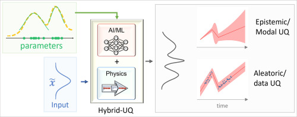
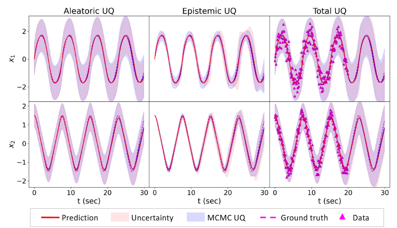

# HybridNDiff-UQ
This repository contains the official implementation of **HybridNDiff-UQ**, an uncertainty quantification framework for hybrid neural differentiable models that integrate numerical representations of known physics with deep neural networks. The proposed approach enables effective and scalable estimation and propagation of both aleatoric uncertainties, arising from data noise, and epistemic uncertainties, stemming from model-form discrepancies and data sparsity. Aleatoric uncertainty is modeled within probabilistic hybrid neural models and propagated through nonlinear components using the unscented transformation, while epistemic uncertainty is approximated via an ensemble of stochastic gradient descent trajectories within a Bayesian model averaging framework. Designed for simplicity and scalability, HybridNDiff-UQ provides a practical approximation of posterior distributions over both neural and physical parameters and is demonstrated on systems governed by ordinary and partial differential equations.


The associated paper can be found here:  
https://www.sciencedirect.com/science/article/pii/S2095034925000418

Model:
<p align="center">
  
</p>

Comparision of predicted UQ with MCMC:
<p align="center">
  
</p>


Details of the experimental datasets, numerical settings, and evaluation protocols are provided in the paper.

---

## Data generation and training training Im-PiNDiff:
The `main_ode.py` and `main_pde.py` are used for both generating the data and traininig the model.


---

## Problem Scope

The framework is demonstrated on representative ordenary and partial differential equations, including:

- Hamiltonian systems  
- Reaction-diffusion system  


---

## Acknowledgments

This work was supported by the Air Force Office of Scientific Research (AFOSR), United States of America (Grant No. FA9550-22-1-0065). JXW would also like to acknowledge the funding support from the Office of Naval Research (Grant No. N00014-23-1-2071) and the National Science Foundation (Grant No. OAC-2047127).

---

## Citation

If you find this work useful, please cite:

```bibtex
@article{akhare4921327hybridndiff,
  title={Hybridndiff-Uq: Uncertainty Quantification for Hybrid Neural Differentiable Modeling},
  author={Akhare, Deepak and Luo, Tengfei and Wang, Jian-Xun},
  journal={Available at SSRN 4921327}
}
